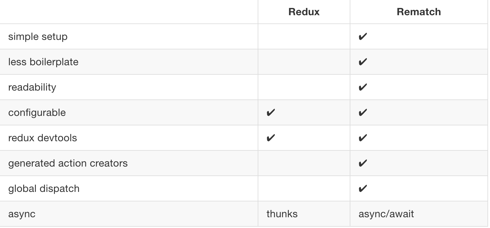

# 🔥 Rematch Todos Demo 🔥

[](https://github.com/xrr2016/rematch-todos/issues) []()

## Why

这个项目起因是为了尝试一下[rematch](https://github.com/rematch/rematch/)，它是一个基于 Redux 的状态管理框架，感觉跟 Vuex 有点相似，用以来比 Redux 简便很多，核心就是 model，dispatch 和 reducers，比 Redux 更好理解, 且无需配置就可使用 [Redux Devtools](https://github.com/zalmoxisus/redux-devtools-extension) 与 [reactotron](https://github.com/zalmoxisus/redux-devtools-extension)。

## First step

定义你的 model, 然后用 init 方法初始化。

```js
// todos.js
export const todos = {
  state: [],
  reducers: {
    addTodo () {...},
    removeTodo () {...},
    editTodo () {...}
  },
  effects: {
    async loadToads () {...}
  }
}
// index.js

import { init } from '@rematch/core'
import { todos } from 'path/todos'

const store = init({
  models: {
    todos
  }
})
```

## Second step

将 store 用 Provider 赋予 App, 在 container 组件中调用 dispatch 方法, 让你定义的 reducers 响应 action 以更新 state。

```js
;<Provider store={store}>
  <App />
</Provider>

// todoInput
import { dispatch } from '@rematch/core'

dispatch.todos.addTodo(newTodo)
// or
dispatch({ type: 'todos/removeTodo', todoId })

// You done！
```

## Compare



## [Live Demo](https://xrr2016.github.io/rematch-todos)


## Usage

```sh
git clone git@github.com:xrr2016/rematch-todos.git

cd rematch-todos && yarn

yarn build

serve -s build
```

## Reference

[Redux](http://www.redux.org.cn/)
[Rematch](https://rematch.gitbooks.io/rematch/#getting-started)
[React-redux](https://redux.js.org/basics/usage-with-react)

## License

MIT
