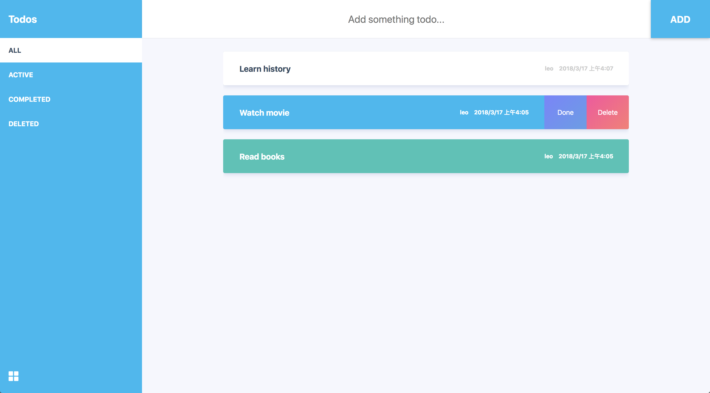

# 🔥 Rematch Todos Demo 🔥

[](https://github.com/xrr2016/rematch-todos/issues)
[]()

## Why

这个项目起因是为了尝试一下[rematch](https://github.com/rematch/rematch/)，它是一个基于 Redux 的状态管理框架，感觉跟 Vuex 的 API 有点类似，用以来比 Redux 简便很多，核心就是 model，dispatch 和 reducers，比 Redux 更好理解。



## [Live Demo](https://xrr2016.github.io/rematch-todos)

## Usage

```sh
git clone git@github.com:xrr2016/rematch-todos.git

cd rematch-todos && yarn

yarn build

serve -s build
```

## License

MIT
